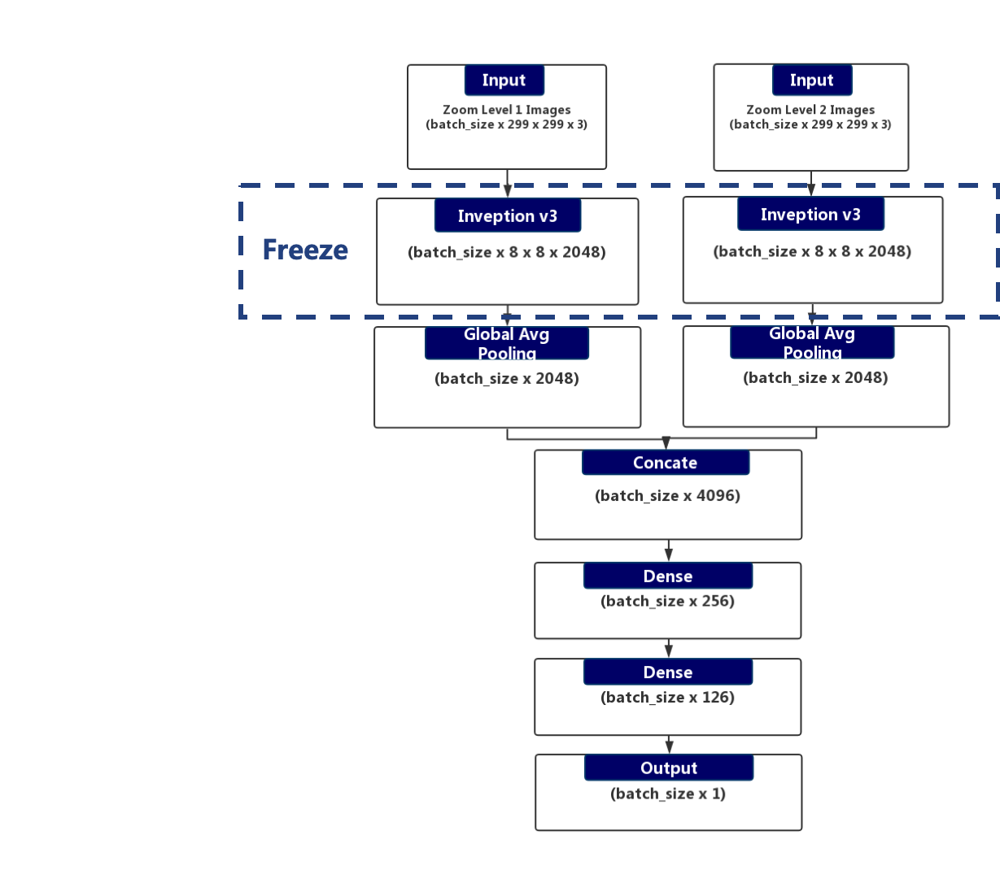
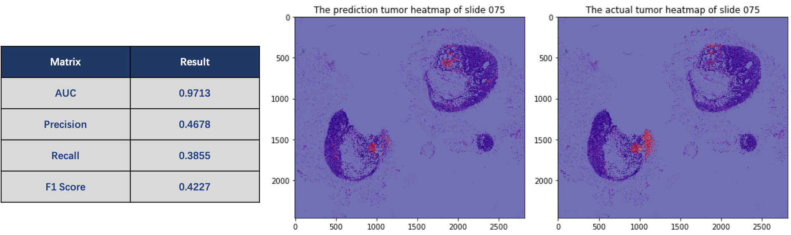
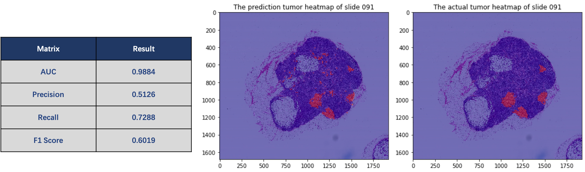
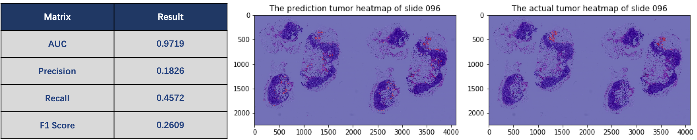

Detecting Cancer Metastases on Gigapixel Pathology Images
============

> **Columbia Applied Deep Learning Course Project (Fall 2019)**  
Author: Yingxiang Chen  
Columbia Uni: yc3526

Objective
------------
Current Situation:  

- Microscopic examination of lymph nodes is crucial in breast cancer staging  
- Currently, the manual process requires highly skilled pathologists  
- The process is fairly time-consuming and error-prone, particularly for lymph nodes with either no or small tumors   

So I want to follow the strategy in the [paper](https://arxiv.org/pdf/1703.02442.pdf) and utilize the deep learning models & techniques to relieve the workload of physicians by creating a workflow to detect and locate tumor pixels in the images and offer automatic second opinions.  

Dataset
------------
- Raw Data: 21 Gigapixel Pathology Images, each has a tumor slide and a corresponding mask from [The CAMELYON16 challenge](https://camelyon16.grand-challenge.org/Data/).  
- Trainset: 8000 (4000 each at two different zoom levels) image patches sampled from 16 Gigapixel Pathology Images.  
- Validation set: 1600 (800 each at two different zoom levels) image patches sampled from 2 Gigapixel Pathology Images.  
- Test set: 3 Gigapixel Pathology Images.  

Image augmentation
------------

Adopt similar augmentation strategies discussed in the [paper](https://arxiv.org/pdf/1703.02442.pdf).  
- Use Keras ImageDataGenerator to augment data  
  - Horizontal_flip 
  - Vertical_flip
  - Rescale
  - Width_shift
  - Height_shift
  - Rotation  

- Use TensorFlow image random function to augment data
  - Random brightness
  - Random saturation
  - Random hue
  - Random contrast  

Model
------------
- Transfer Learning: Used two pre-trained inception v3 models on Imagenet to speed up the training process.  
- Global Pooling: Applied GlobalMaxPooling layer after the inception model to significantly reduce parameters.  

  

Result
------------
- The result on slide 075  

  

- THe result on slide 91  

  

- The result on slide 96 

  

Final Deliverable
------------

- Notebook 1 - Data Sampling  
    - [Jupyter Notebook](./NB1_Data_Cleaning.ipynb)  
    - [Colab Version](https://colab.research.google.com/github/YC-Coder-Chen/Detecting-Cancer-on-Gigapixel-Images/blob/master/NB1_Data_Cleaning.ipynb)  

- Notebook 2 - Data Modeling & Evaluation  
    - [Jupyter Notebook](./NB2_Modeling.ipynb)  
    - [Colab Version](https://colab.research.google.com/github/YC-Coder-Chen/Detecting-Cancer-on-Gigapixel-Images/blob/master/NB2_Modeling.ipynb)  

- Final Model
    - [Shared in Google drive](https://drive.google.com/file/d/1kt5kM_ZrFY7a_xUAha1VWU6nqpfjHUrv/view?usp=sharing)  
    - [Shared in Google storage](https://storage.cloud.google.com/adl-project-yc3526/weights-12-0.94.hdf5)  

- Project Introduction
    - [pdf version](./ADL_Present_Final.pdf)